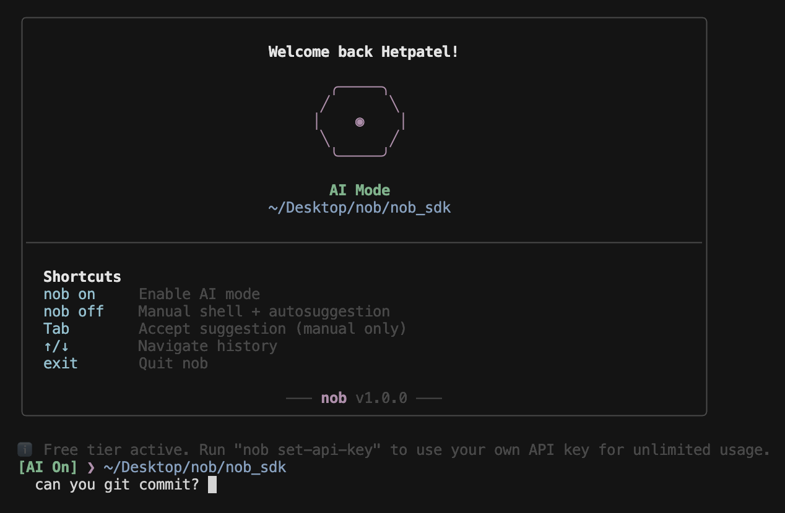
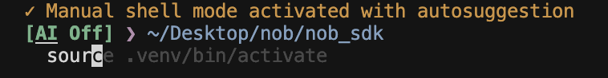

# nob - AI-Powered Terminal Assistant

Make your terminal AI-powered. Describe what you want in plain English, and nob will execute the commands for you.

## Features

### AI Mode (Default)

Describe what you want in natural language, and nob will generate and execute the commands for you.



### Manual Mode with Autosuggestion

Switch to manual mode for traditional terminal usage with AI-powered autosuggestion.

```bash
nob off
```



## Install

```bash
npm install -g nob-cli
```

## Quick Start

```bash
nob
```

That's it! Works out of the box with zero configuration. Works in any terminal (bash, zsh, fish, etc.).

## Commands

**Inside nob:**
- `nob on` - Enable AI mode
- `nob off` - Switch to manual mode with autosuggestion
- `nob exit` - Exit nob

**Before starting nob:**
- `nob set-api-key` - Use your own API key (unlimited usage)
- `nob show-config` - View your configuration
- `nob remove-api-key` - Remove your API key
- `nob help` - Show help

## Rate Limits

By default, nob uses a free shared backend with:
- 100 requests per day
- 100,000 tokens per day

If you hit the limit, use your own API key:

```bash
nob set-api-key
```

This will prompt you for your Cloudflare Workers AI credentials and save them securely.

## License

MIT

---

Created by Het Patel
